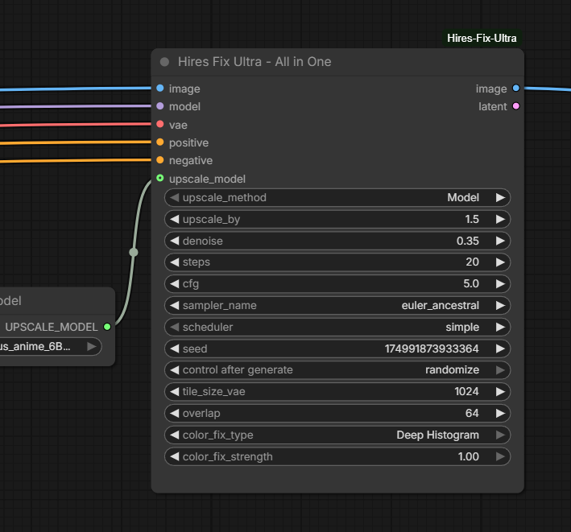

# ComfyUI Hires Fix Ultra - All in One

🚀 **The ultimate, high-performance Hires Fix solution for ComfyUI.** 

<p align="center">


This node simplifies your workflow by combining latent/model upscaling, sampling, and advanced color restoration into a single, VRAM-efficient block. Say goodbye to "color washing" and complex spaghetti workflows.

## ✨ Key Features

*   **📦 Unified Workflow:** Replaces 6+ nodes (VAE Encode, Latent Upscale, KSampler, VAE Decode, Color Match, etc.) with one clean interface.
*   **🎨 Advanced Color Correction:** Features **Deep Histogram Matching** to eliminate the common "graying out" or "fading" effect during high-denoise upscales.
*   **🛡️ OOM Prevention (Tiled VAE):** Built-in Tiled VAE support for both encoding and decoding, allowing you to upscale to 4K and beyond even on mid-range GPUs.
*   **🚀 Hybrid Upscaling:** Choose between **Model-based upscaling** (using ESRGAN, Real-ESRGAN, etc.) or **Latent-based methods** (Bicubic, Bislerp, Area, etc.).
*   **📐 Smart Resizing:** Automatically calculates pixel-perfect dimensions (multiples of 8) based on your upscale factor.

## 🛠 Installation

1.  Open your terminal and go to the `ComfyUI/custom_nodes/` folder.
2.  Clone the repository:
    ```bash
    git clone https://github.com/ThetaCursed/ComfyUI-HiresFix-Ultra-AllInOne.git
    ```
3.  Restart ComfyUI.

## 🚀 How to Use

1.  Add the node: `Image/Upscaling -> Hires Fix Ultra - All in One`.
2.  **Inputs:**
    *   Connect your base **Image**, **Model**, **VAE**, and **Conditioning**.
    *   (Optional) Connect an **Upscale Model** if you select "Model" as the upscale method.
3.  **Settings:**
    *   **upscale_by:** Set your target multiplier (e.g., 1.5x or 2.0x).
    *   **denoise:** Set between `0.30 - 0.55` for extra detail without losing the original composition.
    *   **color_fix_type:** Use **"Deep Histogram"** to maintain 1:1 color accuracy from your low-res original.

## ⚙️ Parameters Reference

| Parameter | Function |
|-----------|----------|
| `upscale_method` | Supports standard Latent methods (Bicubic, Bislerp) or "Model" for ESRGAN-style upscalers. |
| `color_fix_type` | **Deep Histogram:** High-quality color matching. **Standard:** Mean/Std matching. **None:** Default behavior. |
| `tile_size_vae` | Controls the Tiled VAE size. Lower this (e.g., 512) if you encounter Out of Memory errors. |
| `upscale_by` | The scale factor. The node automatically snaps the resolution to the nearest multiple of 8. |

## 🧩 SEO & Search Tags
`ComfyUI`, `Hires Fix`, `High-Res Fix`, `Stable Diffusion`, `Upscaling`, `Color Drift Fix`, `Tiled VAE`, `Latent Upscale`, `Image Restoration`, `AI Art Workflow`.

---
*If you find this node useful, please leave a ⭐ on GitHub!*
